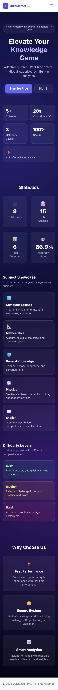
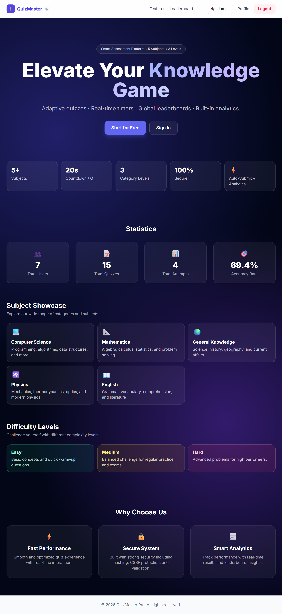
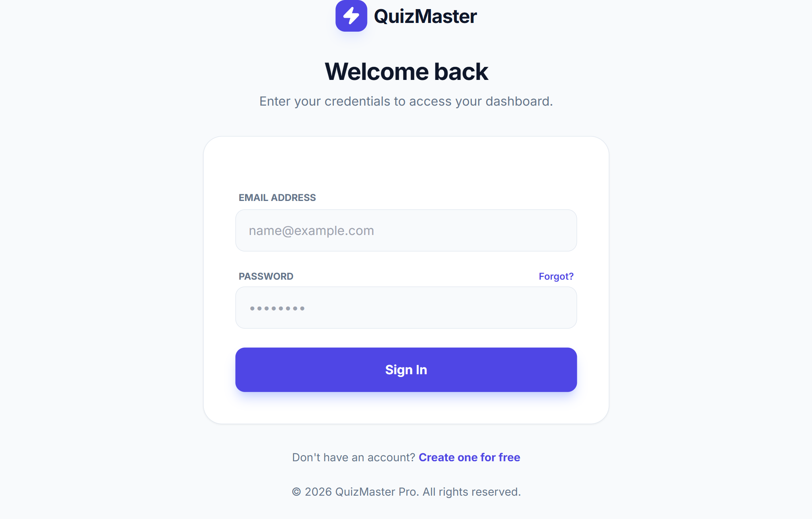
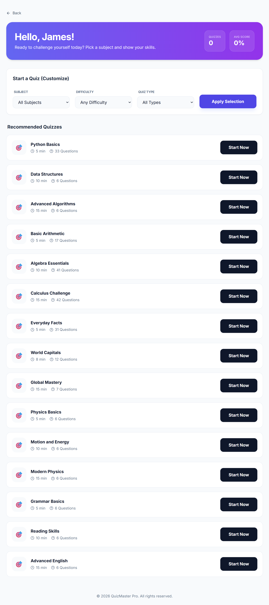
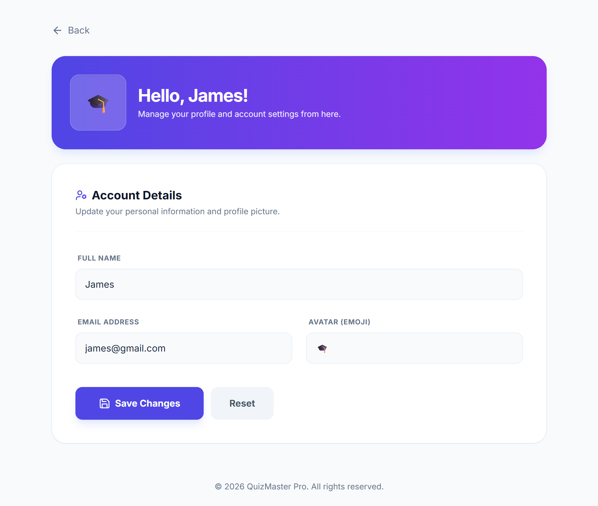
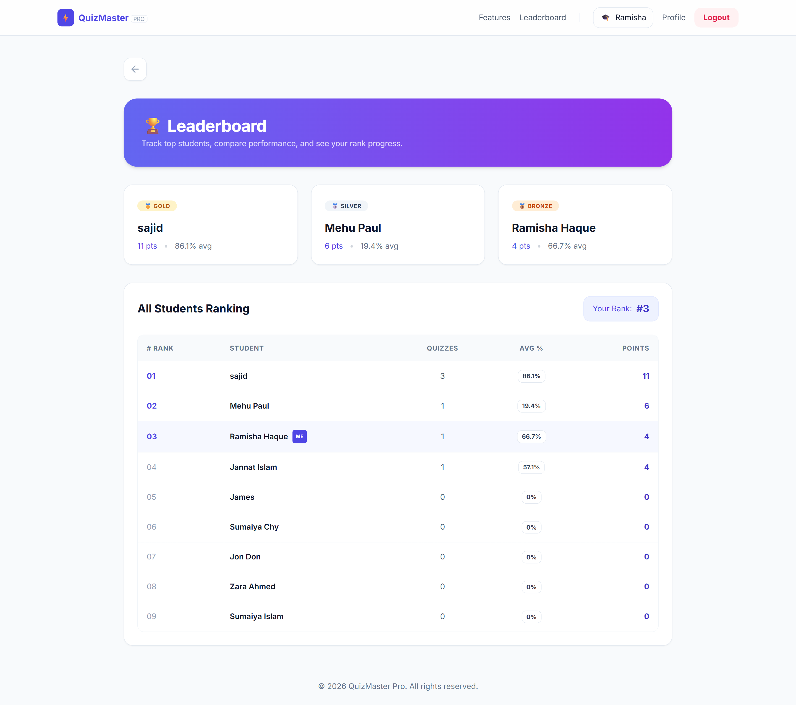

# 🎯 QuizMaster - Online Quiz Web Application

## 📌 Project Overview

QuizMaster is a web-based quiz application that allows users to practice multiple-choice questions (MCQs), track their performance, and compare results through a leaderboard system. It is designed to provide an interactive and user-friendly learning experience.

---

## 🚀 Features

* User registration and login system
* Secure authentication (hashed passwords)
* Subject-based quizzes
* Difficulty levels (Easy, Medium, Hard)
* Timer-based quiz system
* Automatic result calculation
* Leaderboard system
* User profile and settings
* Responsive design (mobile & desktop)

---

## 🛠️ Technologies Used

* Frontend: HTML, CSS, JavaScript, Bootstrap
* Backend: PHP
* Database: MySQL

---

## 🗄️ Database Structure

* Users
* Quizzes
* Questions
* Results

---

## ⚙️ Setup Instructions

1. Install XAMPP
2. Copy the project folder into `htdocs`
3. Open phpMyAdmin
4. Create a database named **quizmaster**
5. Import the SQL file from `sql/schema.sql`
6. Configure database in `config/database.php`
7. Run in browser:
   👉 http://localhost/quizmaster

---

## 🔐 Security Features

* Password hashing using `password_hash()`
* Password verification using `password_verify()`
* Prepared statements to prevent SQL injection

---

## 📱 Mobile Responsiveness

The application is fully responsive and works smoothly on mobile devices
Users can take quizzes, view results, and access the leaderboard smoothly on smaller screens using a clean and adaptive layout.

---.

### Mobile View


---

## 📸 Screenshots

### 🏠 Home



### 🔐 Login



### 📝 Signup


### 📊 Dashboard



### 👤 Profile



### 🏆 Leaderboard



---

## 🎥 Demo Video

👉 The video demonstration of this project has been submitted separately via Google Classroom / Google Form as instructed.

---

## 📂 Project Structure

```
quizmaster/
├── app/
├── config/
├── sql/
├── docs/
├── assets/
```

---

## 👨‍💻 Author

**Sumaiya Islam Chowdhury**
Web Programming Course, SWE
Metropolitan University, Sylhet

---

## 📌 Conclusion

QuizMaster is a complete and functional web application that fulfills all project requirements. It demonstrates practical implementation of web development concepts including authentication, database management, and responsive UI design.
